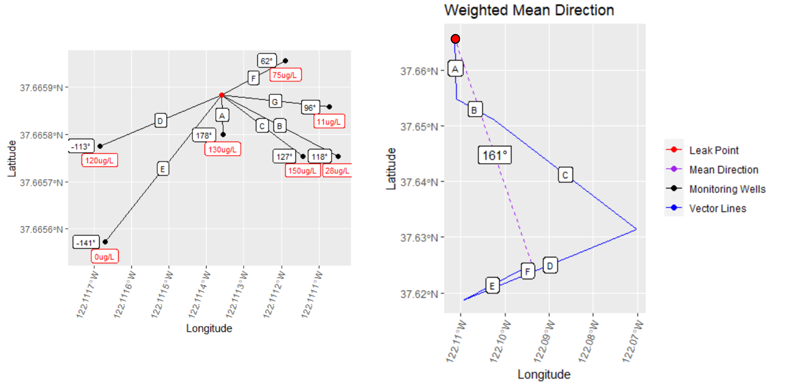

---
# Choose from this list of Journals:
# JGR: Atmospheres, JGR: Biogeosciences, JGR: Earth Surface, 
# JGR: Oceans, JGR: Planets, JGR: Solid Earth, JGR: Space Physics, 
journal: "Geohealth"
classoption: "draft,linenumbers"
title: "Geographic Characterization of Benzene Plumes in California"
authors:
  - name: Andrew R. Murray
    affil: "1, 2"
    thanks: 
  - name: Diego Riveros-Iregui
    affil: 1
    thanks: 
  - name: Alexander Hall
    affil: 3
affiliations:
  - number: 1
    name: "The University of North Carolina - Chapel Hill"
  - number: 2
    name: "Oak Ridge Associated Universities"
  - number: 3
    name: "U.S. Environmental Protection Agency Office of Research and Development"
corresponding_author:
  - name: Andrew Murray
    email: Murray.AndrewR@epa.gov
keypoints:  
  - "Spatial extents of benzene plumes are still poorly understood."
  - "Most plumes are not spatially captured by groundwater testing."
  - "Better models are needed to inform monitoring well selection for leaking sites."
abstract: "Underground storage tanks are tanks buried underground for the purpose of storing and dispensing a wide range of hazardous products, primarily fuel products such as gasoline and diesel. In the United States there are currently 540,000 open (in operation) tanks. Since 2000, there have been more than 118,000 reported releases. When fuel products release into the ground or onto the surface they can contaminate local soil and groundwater resources, as well as pollute the air by means of vapor intrusion. Petroleum hydrocarbons, which are known carcinogens, pose a threat to human and environmental health. They can persist in the environment for decades, and can contaminate drinking water to unsafe levels which are less than the human threshold for smell or taste. Benzene is a carcinogenic petroleum hydrocarbon found in fuel products and several studies have been conducted on it's potential for mobilization in the environment, however these studies generally contain a limited number of sites within a limited geographic area and much remains to be understood related to environmental drivers."
plain_language_summary: ""
always_allow_html: true
output:
    #word_document
    rticles::agu_article:
      extra_dependencies: ["float"]
bibliography: references.bib
header-includes: 
      - \usepackage{soulutf8}  # For UTF8 chars in TrackChanges
      #- \usepackage{float}
      #- \floatplacement{figure}{H}
      #- \usepackage{placeins}
# which is available from this link:
# https://publications.agu.org/files/2019/02/January-14-2019-latex-templates.zip
editor_options: 
  markdown: 
    wrap: 72
---

```{r echo=FALSE, message = FALSE, warning=FALSE, include=FALSE}
# Some recommended settings. 
knitr::opts_chunk$set(
  echo = FALSE,
  fig.pos = '!h',
  out.extra = "",   # To force the use of figure enviroment
  fig.cap = "Please caption every figure",
  warning = FALSE
)

library(tidyverse)
library(sf)
library(vroom)
library(here)
library(kableExtra)
library(cowplot)
require('coin')
library(Hmisc)

# Load analysis data
bd <- vroom(here("Data_Preparation/Analysis_Data/Boundary_Detection_by_site.csv"))%>%
  filter(max_Dist < 1000)
td <- vroom(here("Data_Preparation/Analysis_Data/Benzene_Time_Dist.tsv"))
plumeAreas <- st_read(here("Data_Preparation/Analysis_Data/Rotated_by_Site.gpkg"),layer = "Plume_Lines")%>%
  filter(GLOBAL_ID %in% bd$GLOBAL_ID)
monitorAreas <- st_read(here("Data_Preparation/Analysis_Data/Rotated_by_Site.gpkg"),layer = "Monitor_Area_Lines")%>%
  filter(GLOBAL_ID %in% bd$GLOBAL_ID)

sites <- vroom(here("Data_Preparation/Input_Data/Geotracker/sites.txt"))%>%
  filter(CASE_TYPE == "LUST Cleanup Site")
#bearings <- st_read(here("Data_Preparation/Analysis_Data/Rotated_by_Site.gpkg"),
#                    layer = "All_Points")
```

```{r keypoints_check, echo=FALSE, results='asis', eval = TRUE}
# This chunk adds a warning if any keypoint is longer than 100 characters. 
# To disable it, you can remove it or set eval to FALSE.
if (any(nchar(rmarkdown::metadata$keypoints) > 100)) {
  cat("\\textcolor{red}{\\textbf{Warning}: keypoint(s)", 
      knitr::combine_words(which(nchar(rmarkdown::metadata$keypoints) > 100)), 
      "longer than 100 characters.}")
}
```

# Introduction

Benzene, a carcinogenic component of petroleum products such as gasoline
is known to be released into the environment as the result of leaking
underground storage tanks (LUST). There are currently about 540,000
active petroleum underground storage tank (UST) systems and a backlog of 62,000 LUST sites in the United States \citep{ustperformance}. The definition of a LUST or a release can vary depending on which state or federal regulations you consider. The federal government considers reportable quantities of petroleum products to be anything over 25 gallons, or a spill that cannot be cleaned up within 24 hours \citep{coderegs}. Nationally, for about every 7 active USTs, one will report a release in it's lifetime \citep{ustperformance}. Many studies have been done on benzene plume length and attenuation \citep[e.g.,][]{connor2015, kamath2012, shih2004evaluation}. However, much is still unknown about the behavior and extent of benzene plumes. For example, while most papers focus on distance (one-dimensional), fewer characterize total impacted area (two-dimensional), and those that do, typically focus on only a small number of contaminated sites. A review paper on studies of benzene plume length showed that research in this area included between 22 to 289 LUST sites per study \citep{connor2015}. \citet{mchugh2014progress} included over 4,000 LUST sites, however this was not focused on distance or area but rather trends in concentration over time. A key reason
for the limited number of sites included in these studies is data
availability. Although states are required to test and characterize
sites contaminated or suspected to be contaminated by LUSTs, very limited amounts of these data are made public. In prior studies, authors accumulated limited
amounts of field data from multiple agencies and sources. An exception
to this limited data availability is California's Geotracker database, the largest publicly available database of its kind, which includes field data for LUST cleanup sites dating back to 2000.

An extensive body of work exists relating to groundwater transport of components of gasoline products. Many compounds besides benzene have been studied such as Methyl tert-butyl ether (MTBE) and tert-Butyl alcohol (TBA). Many environmental and chemical-specific factors play into transportability of various compounds through the soil such as soil permeability, water table, solubility, sorption, and retardation to name a few. MTBE and TBA for example, like benzene and BTEX in general are light non aqueous phase liquids, meaning that they generally float on top of the water table, whereas other compounds such as chlorinated aliphatic hydrocarbons (CAHs) are dense non-aqueous phase liquids which sink into the water table \citep{Stupp2007fuel}. MTBE has a solubility in water of 51,000 mg/L \citep{pubchemMTBE}, TBA has a solubility in water of 1,000,000 mg/L \citep{pubchemTBA}, Tetrachloroethylene (PCE), a CAH, which is generally used in industrial and dry-cleaning applications has a solubility in water of 206 mg/L \citep{pubchemPCE}. Benzene has a solubility in water of 17,900 mg/L \citep{pubchemBenz}. Studies have shown that MTBE and TBA, in general behave much like benzene, but exhibit longer plumes. MTBE plumes stretching 1,800 meters have been documented, whereas CAHs have documented plumes extending more than 8,000 meters \citep{Stupp2007fuel}. The implications of these findings suggest that, at a minimum, the factors which drive groundwater transport of compounds related to gasoline and industrial use are highly complex and remain inadequately understood.

There has yet to be a study done on benzene plume areas that
sufficiently considers a large number of field studies, geographic
diversity of sites, and two-dimensional plume shape. Further, no study
has been able to offer insight into how well plume areas are being captured by monitoring wells, which could help to make future testing campaigns more efficient and accurate. In this paper, we consider the largest number of field studies to
date in a two-dimensional study and use publicly available data obtained from California's GeoTracker database to compare our findings with those of \citet{connor2015} to determine how a larger and more diverse sample size supports or disagrees with the findings of other studies. We then spatially normalize plumes by determining the mean linear direction of benzene flow and rotate them so as to artificially overlay them and determine the two-dimensional areas that are most commonly impacted relative to the LOP. Finally, we characterize two-dimensional benzene plume areas to determine how effective monitoring wells are at completely capturing benzene plumes in California and discuss the implications of our results. We find that in the vast majority of LUST cleanup sites, it is likely that plume areas are larger than previously thought. These essential investigations will help to determine if plumes are being effectively measured and inform future efforts to estimate plume extents.


# Materials and Methods

## Release definitions

The definition of a release varies from state to state, however all states must report releases that meet or exceed the criteria of the federal reporting requirements. Many releases do not meet this threshold but may still appear in California's geotracker database. California defines a release as "any spilling, leaking, emitting, discharging, escaping, leaching, or disposing from an underground storage tank into or on the waters of the state, the land, or the subsurface soils" \citep{careport25295.5}. In California, operators are not required to report a release or spill if they are "able to clean up within eight hours after the release was detected or should reasonably have been detected, and which does not escape from the secondary containment, does not increase the hazard of fire or explosion, and does not cause any deterioration of the secondary containment of the underground storage tank." However the operator must record the incident in monitoring reports \citep{careport25294}. If these thresholds are exceeded, the operator must report the spill to the appropriate state agency \citep{careport25295}.

## Evaluating Capture of Plumes by Monitoring Wells

Benzene plumes have been shown to spread over time and can persist for decades. Additionally, benzene plumes can disconnect over time and it is possible to have separation into two plumes \citep{molson2002modeling}, which could lead to undetected plumes beyond testing boundaries, especially if the leak was detected years after a release began. We evaluate plume extents compared with monitoring well extents to determine if plumes are completely captured by monitoring wells or if concentrations greater than 5 ug/L are possibly extending beyond monitoring wells. To test this, we create convex hulls \citep{sf} of the monitoring wells which measured $\ge 5 ug/L$ for every site and also convex hulls for monitoring wells for every site. If a site has a sample that exceeds the federal MCL of 5 ug/L that is spatially coincident with the maximum testing boundary, we consider this 'boundary exceedance'. If the testing boundary and the plume boundary do not intersect, and the plume is entirely within the testing boundary, we consider this 'plume capture' (Figure 1).

```{r exceedsExample, message = FALSE, warning=FALSE,fig.height = 2.5,fig.width=5.5, fig.cap="Example of Plumes that are completely captured by monitoring wells (A) and plumes which likely travel beyond he extent of moniotring wells (B)."}
exceedMW <- td%>%
  filter(GLOBAL_ID == "T0603703120")%>%
  select(GLOBAL_ID,LATITUDE,LONGITUDE)%>%
  distinct()%>%
  st_as_sf(coords = c("LONGITUDE","LATITUDE"), crs = 4326)

plume1 <- td%>%
  filter(GLOBAL_ID == "T0603703120" & PARVAL >=5)%>%
  st_as_sf(coords = c("LONGITUDE","LATITUDE"), crs = 4326)%>%
  st_union()%>%
  st_convex_hull()

sa1 <- td%>%
  filter(GLOBAL_ID == "T0603703120")%>%
  st_as_sf(coords = c("LONGITUDE","LATITUDE"), crs = 4326)%>%
  st_union()%>%
  st_convex_hull()

exceed <- ggplot()+
  geom_sf(data = sa1, aes(color = "Monitor Area"), size = 3,key_glyph = "rect")+
  geom_sf(data = plume1, aes(color = "Plume"), size = 2, key_glyph = "rect")+
  geom_sf(data = exceedMW,aes(fill = "Monitoring Well"), shape = 21,color="black", size = 3,key_glyph = "point")+
  labs(title = "Boundary Exceedance")+
  theme(
  axis.text.x = element_blank(),
  axis.text.y = element_blank(),
  axis.ticks = element_blank(),
  #legend.position = "bottom",
  plot.margin = unit(c(0, 0, 0, 0), "cm"))+
  scale_color_manual(name = "", values = c("Monitor Area" = "#1b9e77","Plume" = "#d95f02"))+
  scale_fill_manual(name = "",values = c("Monitoring Well"="#7570b3"))

captureMW <- td%>%
  filter(GLOBAL_ID == "T0600100111")%>%
  select(GLOBAL_ID,LATITUDE,LONGITUDE)%>%
  distinct()%>%
  st_as_sf(coords = c("LONGITUDE","LATITUDE"), crs = 4326)

plume2 <- td%>%
  filter(GLOBAL_ID == "T0600100111" & PARVAL >=5)%>%
  st_as_sf(coords = c("LONGITUDE","LATITUDE"), crs = 4326)%>%
  st_union()%>%
  st_convex_hull()

sa2 <- td%>%
  filter(GLOBAL_ID == "T0600100111")%>%
  st_as_sf(coords = c("LONGITUDE","LATITUDE"), crs = 4326)%>%
  st_union()%>%
  st_convex_hull()

contain <- ggplot()+
  geom_sf(data = sa2, color = "#1b9e77", size = 3)+
  geom_sf(data = plume2, color = "#d95f02", size = 2)+
  geom_sf(data = captureMW, shape = 21, color = "black", fill = "#7570b3", size = 3)+
  labs(title = "Plume Capture")+
  theme(
  axis.text.x = element_blank(),
  axis.text.y = element_blank(),
  axis.ticks = element_blank(),
  plot.margin = unit(c(0, 0, 0, 0), "cm"))

legend <- get_legend(
  # create some space to the left of the legend
  exceed +
    theme(legend.box.margin = margin(0,0,0,12)))

prow <- plot_grid(
  contain + theme(legend.position="none"),
  exceed + theme(legend.position="none"),
  align = 'vh',
  labels = c("A", "B"),
  label_x = c(.05,.05),
  label_y = .9,
  hjust = 0,
  nrow = 1
)

plot_grid(prow,legend,rel_widths = c(3,1))

```

For area analyses, we included all benzene samples in Geotracker which were taken at LUST cleanup sites and were analyzed as either ug/L or mg/L (91.3% of all
samples). Measurements in mg/L were converted to ug/L. In total, we included `r format(nrow(bd),big.mark = ",")` sites which had at least 3 monitoring wells with benzene concentrations exceeding 5 ug/L so that a two-dimensional space could be delineated. These sites contained `r format(nrow(mwAll),big.mark=",")` spatially unique monitoring wells, with `r format(nrow(benzSampleCount),big.mark=",")` benzene samples, `r format(nrow(gtMCLcount),big.mark = ",")` of which met or exceeded 5 ug/L.

### Boundary Capture driven by Plume Size
To determine if there is a statistically significant difference in plume sizes depending on whether a site exhibited boundary exceedance or plume capture we used the Wilcox test. If sites exhibiting plume capture are significantly different then sites exhibiting boundary exceedance, it could indicate that testing at sites that exhibit boundary exceedance are not effectively monitoring the plumes. Finally, we show the measured distances from the LOP for all monitoring wells used in the two-dimensional analysis to contextualize the findings of the Wilcox test.

## Determining Plume Length

The data obtained from GeoTracker contains groundwater samples from
`r format(length(unique(sites$GLOBAL_ID)),big.mark = ",")` unique LUST sites, however the majority of these sites do not have multiple geolocated monitoring wells with groundwater samples in excess of the fedral MCL (5 ug/L). All data was downloaded from the Geotracker public data portal \citep{geotracker} by county, merged together and filtered to only sites defined as a 'LUST Cleanup Site'. There is no specific way of determining origin point of a release. This is common as most releases are discovered as a result of tank removal and it is often unclear from exactly where a release occurred. While the geotracker database does provide xy locations for both 'UST / UST pit' and 'former UST' locations, these data only exist at less than 200 of LUST cleanup sites. Therefore, we define the leak origin point (LOP) as the point where benzene concentration was the highest at a given site. If there were multiple measurements of the maximum concentration at different points, the earliest measurement was used. As in \citet{connor2015}, the plume is defined as the distance between the LOP and the farthest monitoring well which had a sample above two separate thresholds, 5 ug/L and 10 ug/L to match with methods used by previous studies. To be clear, the current federal MCL for benzene is 5 ug/L. We only use the 10 ug/L threshold for comparison of benzene distance. To delineate two-dimensional areas of plumes, we use the EPA 5 ug/L MCL. Geolocations of wells were projected to the California Albers projection and measured in meters using the sf package \citep{sf}. All analysis in this paper was done with R statistical software \citep{R} and RStudio \citep{RStudio}.


## Characterization of Plume Shape 

We map the distribution of monitoring wells relative to the mean
linear direction of a benzene plume. To determine the mean linear
direction of benzene movement through the ground, we use weighted vector addition to determine the mean angle of flow in degrees from north. We then
artificially rotate the plumes so that they are normalized to one
direction (due north) and overlay them to map out monitoring wells relative
to the leak point and direction of flow and regardless to actual location. Coordinate math was done using the sf package \citep{sf} and bearing directions were calculated using the stplanr package \citep{stplanr}. Data cleaning relied on the tidyverse package \citep{tidyverse}. To weight monitoring wells, benzene concentrations were multiplied by the distance in meters of the monitoring well from the LOP. Lines were then created using existing bearings for each monitoring well from the LOP and lengths from weighted distances. Lines were then redrawn end to end and the mean linear direction was calculated as the bearing between the LOP and the end vertex of the final weighted line (Figure 2).

```{r fig1,fig.height = 4, fig.cap="Illustration of mean direction calculation. Panel A shows actual locations and concentrations of benzene relative to LOP. Panel B shows weighted vector math result with mean linear direction calculation."}
#

source(here("Functions/mean_linear_direction.R"))

# Left Plot: Example of site with monitoring wells and measured concentrations
# Example data:
exSf <- data.frame(ID = c("A","B","C","D","E"),
                   LATITUDE = c(25,50,30,75,10),
                   LONGITUDE = c(-20,-5,16,10,25),
                   PARVAL = c(20,55,40,15,0))%>%
  st_as_sf(coords = c("LONGITUDE","LATITUDE"),crs = 3310, remove = FALSE)
exOrigin <- data.frame(LATITUDE = 0, LONGITUDE = 0)%>%
  st_as_sf(coords = c("LONGITUDE","LATITUDE"),crs = 3310, remove = FALSE)

# Draw lines
exSf$startLat <- 0
exSf$startLon <- 0

exLines <- st_sf(st_sfc(),crs=3310)
for(h in 1:nrow(exSf)){
  exPts <- matrix(c(exSf$startLon,
                    exSf$LONGITUDE[h],
                    exSf$startLat,
                    exSf$LATITUDE[h]),,2)
  
  exLine = st_linestring(exPts)%>%
    st_sfc(crs = 3310)%>%
    st_sf()%>%
    bind_cols(st_drop_geometry(exSf[h,]))
  exLines <- rbind(exLines,exLine)
}

lp1 <- ggplot()+
  geom_sf(data = exLines, aes(color = "Drawn Lines"))+
  geom_sf(data = exSf, aes(color = "Monitoring Wells"), size = 2)+
  geom_sf(data = exOrigin, aes(color = "Leak"), size = 2)+
  scale_color_manual(name = "", values = c("Drawn Lines" = "black",
                                           "Monitoring Wells" = "orange",
                                           "Leak" = "red"))+
  geom_sf_label(data = exSf,aes(label=paste0(ID,": ",PARVAL," ug/L")),nudge_y = 5, nudge_x = 12)+
  coord_sf(datum=st_crs(3310))+
  labs(x = "meters", y = "meters")+
  xlim(-35,60)+
  theme(legend.direction = "horizontal", legend.position = c(0.4,-0.2),
        plot.margin = margin(0,0,1.5,0, "cm"))

# Right Plot: Example of vector math to calculate mean linear direction
exMWs <- st_drop_geometry(exSf)
start_x <- 0
start_y <- 0
crs <- 3310
startLon <- start_x
startLat <- start_y

weightedLines <- st_sf(st_sfc(),crs=3310)
  
  for (j in 1:nrow(exMWs)) {
    #print(paste0("Iteration #",j))
    # Select one monitoring well
    mw <- exMWs[j,]
    rowWeight <- exMWs$PARVAL[j]
    # Create points matrix
    bearingPts <- matrix(c(start_x,
                           mw$LONGITUDE,
                           start_y,
                           mw$LATITUDE),,2)
    
    # Create a buffer from the origin point, using the weighted length
    # then select the point on the buffer closest to the monitoring well
    # Then draw a new line from the origin point to the selected point on
    # the buffer line. This is your new weighted line.
    
    bearingLine = st_linestring(bearingPts)%>%
      st_sfc(crs = 3310)%>%
      st_sf()%>%
      bind_cols(mw)
    
    #angle <- stplanr::line_bearing(bearingLine)
    
    length <- bearingLine%>%
      st_transform(crs = crs)%>%
      st_length()%>%
      as.numeric()
    
    weightedLength <- as.numeric(length)*as.numeric(rowWeight)
    
    if(weightedLength > 0){
      # Project mw point
      mwSf <- data.frame("X"=mw$LONGITUDE, "Y" = mw$LATITUDE)%>%
        st_as_sf(coords = c("X","Y"), crs = 3310)%>%
        st_transform(crs = crs)
      
      # Buffer then convert to points
      buf <- exOrigin%>%
        st_buffer(length)%>%
        st_cast("POINT")
      
      # Select nearest point to the monitoring well
      near <- st_nearest_feature(mwSf,buf)
      weightedEnd <- buf[near,]
      # weightedEndWGS <- weightedEnd%>%
      #   st_transform(4326)
      weCoords <- as.data.frame(st_coordinates(weightedEnd))
      
      # Calculate new endpoint from previous start point
      # Do this by calculating delta X/Y from origin, then
      # adding it to previous end point
      deltLat <- weCoords$Y - start_y
      endLat <- startLat + deltLat
      deltLon <- weCoords$X - start_x
      endLon <- startLon + deltLon
      
      # Create points matrix
      pts <- matrix(c(startLon,
                      endLon,
                      startLat,
                      endLat),,2)
      
      newLine = st_linestring(pts)%>%
        st_sfc(crs = 3310)%>%
        st_sf()%>%
        bind_cols(mw)
      
      # Test plot
      # ggplot()+
      #   geom_sf(data = originSf, shape = 4)+
      #   geom_sf(data = newLine)+
      #   geom_sf(data = mwSf, fill = "red", shape = 23)+
      #   geom_sf(data = buf)+
      #   geom_sf(data = weightedEnd, fill = "blue",shape = 21, size = 3)+
      #   geom_sf_label(data = mwSf, aes(label = PARVAL), nudge_y = 25, nudge_x = 25)+
      #   labs(title = "Weighting Directional Lines", x = "Longitude",y="Latitude")+
      #   theme(axis.text.x = element_text(angle = 70, vjust = 1.3, hjust=1.3))
      
      
      
      
      weightedLines <- rbind(weightedLines,newLine)
      
      # Update starting point for next iteration
      startLat <- endLat
      startLon <- endLon
      
    }
        
    
    
    # Once we reach the end, output the last endpoint to determine
    # mean angle
    
    if(j == nrow(exMWs)){
      #print("Finding Mean Direction ...")
      endPt <- matrix(c(exOrigin$LONGITUDE,
                        endLon,
                        exOrigin$LATITUDE,
                        endLat),,2)
      
      meanDirectionLine <- st_linestring(endPt)%>%
        st_sfc(crs = 3310)%>%
        st_sf()%>%
        st_transform(4326)
      
      bearing <- stplanr::line_bearing(meanDirectionLine)
      
      #meanDirectionLine$Bearing <- bearing
    }
  }

# Get centroids for labels
exCntrds <- st_centroid(weightedLines)
mldCntrd <- st_centroid(meanDirectionLine)

# Endpoints for plotting
weightedPts <- st_cast(weightedLines, "POINT")

rp1 <- ggplot(weightedLines)+
  geom_sf()+
  geom_sf(data= meanDirectionLine, aes(color = "Mean Plume Direction"), linetype = "dashed")+
  geom_sf(data = weightedPts,color = "orange", size = 1.5,show.legend = FALSE)+
  geom_sf_label(data = exCntrds, aes(label = ID),nudge_x = 0)+
  geom_sf_label(data = mldCntrd, label = paste0(round(bearing,2),"°")  ,nudge_x = 15)+
  geom_sf(data = exOrigin, color = "red", size = 2)+
  scale_color_manual(name = "", values = c("Mean Plume Direction" = "blue"))+
  coord_sf(datum=st_crs(3310))+
  labs(x = "meters", y = "meters")+
  xlim(-80,80)+
  theme(legend.direction = "horizontal", legend.position = c(0.1,-0.2),
        plot.margin = margin(0,0,1.5,0, "cm"))
  
plot_row <- plot_grid(lp1,rp1,nrow=1, align = "h",labels = c('A', 'B'),
                      label_x = .2,
                      label_y = .97)  

# now add the title
title <- ggdraw() + 
  draw_label(
    "Example of Plume Mean Linear Direction Calculation",
    fontface = 'bold',
    x = 0,
    hjust = 0
  ) +
  theme(
    # add margin on the left of the drawing canvas,
    # so title is aligned with left edge of first plot
    plot.margin = margin(0, 0, 0, 7)
  )
plot_grid(
  title, plot_row,
  ncol = 1,
  # rel_heights values control vertical title margins
  rel_heights = c(0.1, 1)
)
```

```{r geotrackerStats}
mwAll <- td%>%
  filter(GLOBAL_ID %in% bd$GLOBAL_ID)%>%
  select(GISID)%>%
  distinct()

benzSampleCount <- td%>%
  filter(GLOBAL_ID %in% bd$GLOBAL_ID)

gtMCLcount <- td%>%
  filter(GLOBAL_ID %in% bd$GLOBAL_ID & PARVAL >= 5)
```


# Results

```{r resultCode}

# CODE IS NOT IN ORDER OF METHODS PRESENTED

# --- DISTANCE CODE ---
# 10 ug/L
maxDist10 <- td%>%
  filter(PARVAL >= 10)%>%
  group_by(GLOBAL_ID)%>%
  mutate(maxDist = max(Distance_m))%>%
  ungroup()%>%
  select(GLOBAL_ID, maxDist)%>%
  distinct()%>%
  filter(maxDist < 1000)

maxDist10Pdf <- maxDist10%>%
  mutate(maxDist = if_else(maxDist > 600,600, maxDist))%>%
  filter(maxDist>1)

# 5 ug/L
maxDist5 <- td%>%
  filter(PARVAL >= 5)%>%
  group_by(GLOBAL_ID)%>%
  mutate(maxDist = max(Distance_m))%>%
  ungroup()%>%
  select(GLOBAL_ID, maxDist)%>%
  distinct()%>%
  filter(maxDist < 1000)

maxDist5Pdf <- maxDist5%>%
  mutate(maxDist = if_else(maxDist > 600,600, maxDist))%>%
  filter(maxDist > 1)


# Get ninetieth percentile for 10 ug/L
ninety10 <- quantile(maxDist10$maxDist,.9)
# Convert from meters to feet
ft10 <- ninety10*3.28084

# Get ninetieth percentile for 5 ug/L
ninety5 <- quantile(maxDist5$maxDist,.9)

# --- DISTANCE PLOTS ---
max10Plot <- ggplot(maxDist10Pdf)+
  geom_histogram(aes(x = maxDist),binwidth = 10,color = "black",fill = "#c7ae3e")+
  xlim(0,640)+
  ylim(0,1000)+
  geom_segment(x=91.44 ,y =0, xend=91.44, yend =800)+
  annotate("text", x = 200, y = 780, label = "Reisinger et al. (2000)")+
  geom_segment(x=137 ,y =0, xend=137, yend =700 )+
  annotate("text", x = 240, y = 680, label = "Mace & Choi (1998)")+
  geom_segment(x=524 ,y =0, xend=524, yend =600 )+
  annotate("text", x = 435, y = 570, label = "Rice et al. (1995)")+
  labs(title = "Maximum Distance of Benzene > 10 ug/L (A) and 5 ug/L (B)",
       x = "Meters",y = "Count of Sites")+
  scale_x_continuous(breaks=c(0,200,400,600),
        labels=c("0", "200", "400","> 600"))+
  theme(axis.title.x=element_blank(),
        axis.text.x=element_blank(),
        axis.ticks.x=element_blank(),
        plot.margin = margin(0, 0, -.1, 0, "cm"))

max5Plot <- ggplot(maxDist5Pdf)+
  geom_histogram(aes(x = maxDist),binwidth = 10,color = "black",fill = "#c7ae3e")+
  xlim(0,640)+
  ylim(0,1000)+
  geom_segment(x=168 ,y =0, xend=168, yend =700 )+
  annotate("text", x = 250, y = 680, label = "Shi et al. (2004)")+
  geom_segment(x=305 ,y =0, xend=305, yend =600)+
  annotate("text", x = 405, y = 580, label = "Riffai & Rixey (2004)")+
  geom_segment(x=502 ,y =0, xend=502, yend =450 )+
  annotate("text", x = 435, y = 380, label = str_wrap("Kamath et al. (2012)",13))+
  labs(x = "Meters",y = "Count of Sites")+
  scale_x_continuous(breaks=c(0,200,400,600),
        labels=c("0", "200", "400","> 600"))+
  theme(plot.margin = margin(-.1, 0, 0, 0, "cm"))

## Join max distance and median PARVAL
medPARVAL <- td%>%
  filter(PARVAL > 0)%>%
  group_by(GLOBAL_ID)%>%
  mutate(medPARVAL = median(PARVAL))%>%
  ungroup()%>%
  select(GLOBAL_ID,medPARVAL)%>%
  distinct()

# --- NORMALIZED DIRECTION CODE/PLOTS ---
# Join boundary detection to plume lines
areasBound <- plumeAreas%>%
  left_join(bd, by = "GLOBAL_ID")

# Filter on TRUE or FALSE
plumeAreasPC <- areasBound%>%
  filter(BoundIntrsct == FALSE)

plumeAreasBE <- areasBound%>%
  filter(BoundIntrsct == TRUE)

# Join boundary detection to monitoring area lines
maBound <- monitorAreas%>%
  left_join(bd, by = "GLOBAL_ID")

#Filter on TRUE or FALSE
maPC <- maBound%>%
  filter(BoundIntrsct == FALSE)

maBE <- maBound%>%
  filter(BoundIntrsct == TRUE)


# Add info for colors and facets
paPCsel <- plumeAreasPC%>%
  select(GLOBAL_ID,Area_m)%>%
  mutate(facet = "Capture : Plumes",
         cat = "Plumes",
         N = length(facet))
paBEsel <- plumeAreasBE%>%
  select(GLOBAL_ID,Area_m)%>%
  mutate(facet = "Exceedance : Plumes",
         cat = "Plumes",
         N = length(facet))
maPCsel <- maPC%>%
  select(GLOBAL_ID,Area_m)%>%
  mutate(facet = "Capture : Monitor Areas",
         cat = "Monitor Areas",
         N = length(facet))
maBEsel <- maBE%>%
  select(GLOBAL_ID,Area_m)%>%
  mutate(facet = "Exceedance : Monitor Areas",
         cat = "Monitor Areas",
         N = length(facet))

allAreas <- rbind(maPCsel,paPCsel,maBEsel,paBEsel)

#Plot
areaPlots <- ggplot(allAreas)+
  geom_sf(alpha=.05, aes(color = cat))+
  scale_color_manual(values = c("#1b9e77","#d95f02"))+
  xlim(-400,400)+
  ylim(-200,200)+
  coord_sf(datum = st_crs(3310))+
  geom_segment(x=0,xend=0,y=-100,yend=100,linetype=3)+
  geom_segment(x=-100,xend=100,y=0,yend=0,linetype=3)+
  geom_label(x = 275,y = -175, aes(label =  paste0("N=",format(N,big.mark =","))))+
  theme(plot.margin = margin(0,0,0,0, unit = "cm"),
        legend.position="bottom")+
  facet_wrap(~facet)+
  theme(plot.margin=unit(c(0,0,0,0), "cm"))+
  guides(colour = guide_legend(override.aes = list(alpha = 1),title=""))


# --- SUBSET DATA BASED ON BOUNDARY EXCEEDANCE ---
areaCompare <- bd%>%
  left_join(plumeAreas, by = "GLOBAL_ID")

capture <- areaCompare%>%
  filter(BoundIntrsct == FALSE)

exceedance <- areaCompare%>%
  filter(BoundIntrsct == TRUE)

# --- MONITORING WELL DISTANCE CODE ---
uniqueMW <- td%>%
  filter(POINT_TYPE == "MW" & GLOBAL_ID %in% bd$GLOBAL_ID)%>%
  select(GISID,Distance_m)%>%
  distinct()

distQuantiles <- as.data.frame(quantile(uniqueMW$Distance_m,c(.25,.5,.75,.9)))%>%
  mutate(Distance = round(.[[1]],2))%>%
  select(Distance)

uniqueMWPdf <- uniqueMW%>%
  mutate(Distance_m = ifelse(Distance_m > 200,200,Distance_m))

```


## Maximum Plume Distance

Plume maximum distances were calculated for `r format(nrow(maxDist10),big.mark = ",")` sites which had measurable distances (at least 2 unique monitoring wells) with $\ge 10 ug/L$ and `r format(nrow(maxDist5),big.mark=",")` sites which had measurable distances with $\ge 5 ug/L$ (Figure 3). The median distance for plumes delineated at 10 ug/L was `r format(median(maxDist10$maxDist),nsmall=1)` meters. The 90th percentile distance of plumes delineated at 10 ug/L was `r format(ninety10,digits = 0,nsmall=1)` meters. The median distance for plumes delineated at 5 ug/L was `r format(median(maxDist5$maxDist),nsmall=1)` meters. The 90th percentile distance of plumes delineated at 5 ug/L was `r format(ninety5,digits=0,nsmall=1)` meters

Figure 3 shows the maximum distance benzene that was measured from the point of origination. The 90th percentile for benzene distance is 595 feet for 5 ug/L which falls within the findings of \citet{connor2015}.
```{r maxDistPlots, message = FALSE, warning=FALSE, fig.height=5, fig.width=5.5, fig.cap="Histogram of maximum measured distance of benzene plumes in meters using thresholds of 10 ug/L (A) and 5 ug/L (B). Maximum distances from previous studies are overlaid. The width of bins is 10m."}
plot_grid(max10Plot,max5Plot, align = "v",
          nrow = 2,
          labels = c("A","B"),
          label_x = .1,
          label_y = c(.85,.95))
```

```{r ecdf,fig.height= 3,fig.width = 6, fig.cap="Cumulative Distribution Function of plume lengths (5 ug/L)."}
# Calculate MinorityLowincome Weighted Percentiles (AEJ2)
# ecdf.results <- Hmisc::wtd.Ecdf(bd$max_Dist, normwt = FALSE, type='i/n',
#                                 na.rm=TRUE)%>%
#   as.data.frame()
# ggplot(ecdf.results)+
#   geom_line(aes(x = x, y = ecdf*100),size = 1.5)+
#   xlim(0,600)+
#   labs(title = "Cumulative Distrubtion of Plume Lengths",x = "Maximum Distance [m]", y = "Percent of Plumes")
```


```{r boundaryExceedance, message = FALSE, warning=FALSE, fig.height = 3.5, fig.width = 6, fig.cap="Exceedance classification for every LUST cleanup site in California with more than 3 sampling points > 5 ug/L shown with maximum plume distance and median concentration at site."}
# Script 06_Boundary_Detection.R

# plotAll <- ggplot(bd)+
#   geom_point(aes(x = max_Dist, y = median_Parval, color = BoundIntrsct), alpha = .5)+
#   scale_color_manual(values = c("#1b9e77","#d95f02"))+
#   scale_y_continuous(labels=function(x) format(x, big.mark = ",", scientific = FALSE))+
#   labs(title = "MCL Exceedance Measured at Testing Boundary",
#        x = "Distance from Release [m]",
#        y = "Median Benzene Concentration at Site [ug/L]",
#        color = "MCL Exceeded")+
#   xlim(0,600)+
#   ylim(0,25000)
# 
# ## Zoom in
# bdSub <- bd%>%
#   filter(median_Parval < 1000 & max_Dist < 200)
# plotSub <- ggplot(bdSub)+
#   geom_point(aes(x = max_Dist, y = median_Parval, color = BoundIntrsct),
#              show.legend = FALSE, alpha = .5)+
#   scale_color_manual(values = c("#1b9e77","#d95f02"))+
#   labs(title = "",
#        x = "",
#        y = "",
#        color = "MCL Exceeded")+
#   scale_y_continuous(labels=function(x) format(x, big.mark = ",", scientific = FALSE))+
#   theme(panel.border = element_rect(colour = "black", fill=NA, size=2))
# 
# plotAll + annotation_custom(ggplotGrob(plotSub), xmin = 200, xmax = 600,
#                        ymin = 10000, ymax = 28000)
```


## Directionally Normalized Plumes and Study Areas
We found `r format(nrow(bd),big.mark = ",")` plumes with at least 3 points with benzene concentrations $\ge 5 ug/L$. We calculated mean linear direction of benzene flow and rotated each plume to due north. Each plume was overlaid by shifting the leak origination point to the coordinates (0,0) in the California albers projection.


```{r AllplumeAreas, message = FALSE, warning=FALSE,fig.align = "center",fig.height = 4.5,fig.width=5, fig.cap="Visualization of all monitoring areas and plume areas superimposed on top of eachother. Line transparency = 95 percent."}
areaPlots
```


## Monitoring Well Distances

The distances of all spatially unique monitoring wells were measured from their respective LOPs. Figure 6 shows a histogram as well as the 25th, 50th, 75th and 90th percentiles of maximuim benzene plume distances. The median distance of all monitoring wells from the LOP was `r format(distQuantiles$Distance[2],nsmall = 1)` meters. 90% of monitoring wells were within `r format(distQuantiles$Distance[4],nsmall = 1)` meters of the LOP.

```{r mwDistsPlot, fig.height = 2.5, fig.width = 6, fig.cap="Histogram of monitoring well distances used in area analysis with the 25th, 50th, 75th and 90th percentiles overlaid. Bin width = 5m"}
ggplot(uniqueMWPdf)+
  geom_histogram(aes(x = Distance_m),binwidth = 5,
                 fill = "#7570b3",color = "black")+
  geom_vline(data = distQuantiles, aes ( xintercept = Distance, color = rownames(distQuantiles)),size = 1.5)+
  guides(color=guide_legend(title="Percentile"))+
  scale_x_continuous(breaks=c(0,50,100,150,200),
        labels=c("0","50", "100","150",">200"))+
  scale_y_continuous(labels=function(x) format(x, big.mark = ",", scientific = FALSE))+
  labs(title = "Monitoring Well Distances",
       x = "Distance [m]",y = "Monitoring Wells [count]")
```


# Conclusions & Discussion

```{r}
gt90 <- maxDist5%>%
  filter(maxDist >=ninety5)%>%
  distinct()
```


While statistically, the maximum distance of 90% of plumes falls within the bounds of previous research, this is not necessarily the best way to consider potential impacts of petroleum hydrocarbons in the environment. California for example has particularly strict reporting requirements, meaning that even very small releases are documented, and the sites undergo soil and groundwater testing, leading to a disproportionate weighting of plumes towards smaller releases relative to documented releases in other states which have reporting requirements more aligned with federal regulations. However, there are still many plumes of concern that reach beyond the ninetieth percentile, in this case 
`r nrow(gt90)` sites. Further, our research finds that the vast majority of plumes recorded are likely larger then previously thought, with maximum distances that are longer than have been reported in the data. While previous research has not stated whether or not plumes were entirely captured by monitoring, it stands to reason that prior site investigations may have suffered from the same limitations as are present in the geotracker data. Limitations to testing often include both physical impediments and property boundaries. For example, many gas stations are located in urbanized areas, meaning that impervious, paved surfaces and other structures can limit the areas where testing is possible. Additionally, there may be several other private properties within a very small distance, making getting permission to test difficult. Releases can enter the ground in many ways. The release can originate underground, directly from a tank that has suffered corrosion, or from leaky piping connections, or it can originate on the surface from a spill or overfill and migrate into the ground directly, or through overland flow and via preferential pathways such as cracked pavement.

Our findings suggest that plumes are larger than the data suggests. Plumes are significantly larger when they are not captured by monitoring wells, suggesting that the sites which exhibit plume capture may be doing so simply because they are smaller in tw0-dimensional area. Larger plumes are less likely to be completely captured because the burden for doing so is higher. While the limitations of testing in the real world are clear, and are not likely to be overcome in their entirety, this research clearly shows that there is still much that is unknown about how benzene plumes move through the environment and how much area they can impact in unsafe levels. There is a need for better modelling and understanding of these plumes. If we are able to more effectively model the full extent of benzene plumes, we may be able to aid in future site investigations without an additional burden on agencies responsible for site testing and characterization. While on-site sampling will always be the most reliable way to characterize a plume, additional modelling and understanding may help future site investigations to be more efficient by helping to prioritize monitoring well locations.


\acknowledgments

The authors of this paper have no conflicts of interest to declare. The views expressed in this paper are those of the authors and do not necessarily represent the views or policies of the U.S. Environmental Protection Agency. All analysis, statistics and spatial analyses were completed using R version 4.1.2. All California LUST data were obtained from the California Water Board's Geotracker public portal (https://geotracker.waterboards.ca.gov/data_download_by_county). All code used in this research is publicly available on GitHub (https://github.com/USEPA/ORD_Plume_Paper).
